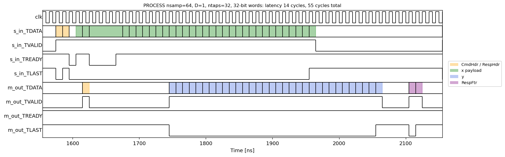
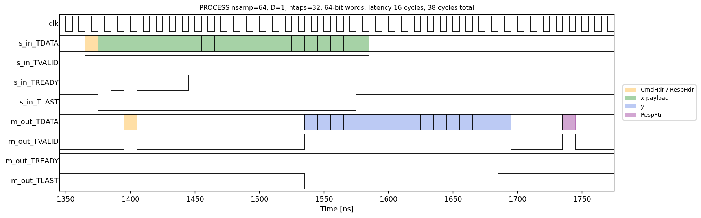

# Command-driven FIR accelerator: results

The accelerator of `prompt.md`, built with Waveflow the way the `stream_inband` reference
(the streaming polynomial) is built: hook-first, with Waveflow generating the schemas' C++
and the kernel boundary, and everything checked against expected responses computed from
each scenario's intent.  Everything is in `fir/`:

| File | What it is |
| --- | --- |
| `fir/fir.py` | Schemas; `fir_eval` (arithmetic); `fir_command` / `fir_stream_model` (the bit-exact protocol model); the module `FirAccel` and the pysim testbench |
| `fir/scenarios.py` | The 20 named scenarios (intents), their stimulus, their expected responses, the checker |
| `fir/fir_body_impl.tpp` | The whole kernel body in C++ (hand-written) |
| `fir/fir_tb.cpp` | The C++ testbench (csim and cosim) |
| `fir/fir_build.py`, `fir/run.tcl` | The build DAG and the Vitis driver |
| `fir/gen/fir.cpp`, `fir/gen/fir.hpp`, `fir/include/*` | Generated by Waveflow; never edited |
| `fir/worked_examples.py`, `fir/checker_demo.py`, `fir/make_layout.py` | Stage 1: worked examples, checker rejections, the wire layout |
| `fir/timing_analysis.py` | Timing numbers and the timing figure from the cosim VCD |
| `fir/quick_synth.py`, `fir/quick_impl.py`, `fir/impl.tcl` | Synthesis-only and Vivado place-and-route runs |
| `fir/results/` | Every check, log and report cited below |

Reproduce: `cd fir; python worked_examples.py; python checker_demo.py; python fir_build.py --through summary;
python quick_synth.py 32; python quick_impl.py 32; python quick_synth.py 64; python quick_impl.py 64; python make_results.py`.

## 1. Results

Every verdict below comes from a check step, a build step or a tool report, never from
reading code.  `make_results.py` writes this table from those files.

| Criterion | Target | Measured | Verdict | Source |
| --- | --- | --- | --- | --- |
| Worked examples pin `fir_eval` | >= 8 hand-computed, incl. half and both saturations | 15/15 pass | PASS | `fir/results/worked_examples.txt` |
| Checker rejects wrong outputs | 3 constructed wrong variants rejected, per width | 6/6 rejected | PASS | `fir/results/checker_rejects.txt` |
| Python model vs expected, 32-bit | all 21 checks bit-exact | 21/21 | PASS | `fir/results/check_model.json` |
| Python model vs expected, 64-bit | all 21 checks bit-exact | 21/21 | PASS | `fir/results/check_model.json` |
| pysim vs expected (well-formed scenarios), 32-bit | all 20 checks bit-exact | 20/20 | PASS | `fir/results/check_pysim.json` |
| pysim vs expected (well-formed scenarios), 64-bit | all 20 checks bit-exact | 20/20 | PASS | `fir/results/check_pysim.json` |
| C simulation vs expected, 32-bit | all 21 checks bit-exact | 21/21 | PASS | `fir/results/check_csim.json` |
| C simulation vs expected, 64-bit | all 21 checks bit-exact | 21/21 | PASS | `fir/results/check_csim.json` |
| RTL co-simulation vs expected, 32-bit | all 21 checks bit-exact | 21/21 | PASS | `fir/results/check_cosim.json` |
| RTL co-simulation vs expected, 64-bit | all 21 checks bit-exact | 21/21 | PASS | `fir/results/check_cosim.json` |
| Block splitting: whole == pieces, 32-bit | identical y in model, pysim, csim, cosim | model: same, pysim: same, csim: same, cosim: same | PASS | `fir/results/check_*.json, key split_property` |
| Block splitting: whole == pieces, 64-bit | identical y in model, pysim, csim, cosim | model: same, pysim: same, csim: same, cosim: same | PASS | `fir/results/check_*.json, key split_property` |
| Steady-state input rate, PROCESS ntaps=32 D=1, 32-bit | 1 word / cycle | 1.000 words/cycle (2 samples/cycle) | PASS | `fir/results/cosim_timing.json` |
| Steady-state input rate, PROCESS ntaps=32 D=1, 64-bit | 1 word / cycle | 1.000 words/cycle (4 samples/cycle) | PASS | `fir/results/cosim_timing.json` |
| HLS clock estimate, 32-bit | <= 7.30 ns (10 ns - 2.7 ns default uncertainty) | 6.859 ns | PASS | `fir/results/synth.json, fir/results/reports/w32_csynth.rpt` |
| HLS clock estimate, 64-bit | <= 7.30 ns (10 ns - 2.7 ns default uncertainty) | 7.122 ns | PASS | `fir/results/synth.json, fir/results/reports/w64_csynth.rpt` |
| Post-route timing (Vivado), 32-bit | 10 ns met | 8.700 ns | PASS | `fir/results/reports/w32_impl_export.rpt` |
| Post-route timing (Vivado), 64-bit | 10 ns met | 9.623 ns | PASS | `fir/results/reports/w64_impl_export.rpt` |
| pysim timing model vs cosim, w32 n64 | abs(delta) <= 20 cycles | pysim 53, cosim 52, delta 1 | PASS | `fir/results/timing_verdict.json` |
| pysim timing model vs cosim, w32 n1024 | abs(delta) <= 20 cycles | pysim 533, cosim 532, delta 1 | PASS | `fir/results/timing_verdict.json` |
| pysim timing model vs cosim, w64 n64 | abs(delta) <= 20 cycles | pysim 36, cosim 37, delta 1 | PASS | `fir/results/timing_verdict.json` |
| pysim timing model vs cosim, w64 n1024 | abs(delta) <= 20 cycles | pysim 276, cosim 277, delta 1 | PASS | `fir/results/timing_verdict.json` |
| Ready for the next command when one finishes | next header accepted right after the footer | 4-4 cycles (32-bit), 4-4 (64-bit), footer to next header, over all 73 commands | PASS (see note) | `fir/results/cosim_timing.json` |
| Part | xc7z020clg400-1 | xc7z020-clg400-1 | PASS | `fir/results/synth.json` |
| Control interface | `ap_ctrl_none`, no ports but the two streams | `ap_ctrl_hs` through `s_axilite port=return` (one AXI-Lite control port, no register fields) | **FAIL** | `fir/gen/fir.cpp` |

**Not met, stated plainly:**

- **FAIL: `ap_ctrl_none`.**  The kernel has one port besides the two streams: the AXI-Lite
  control port that `s_axilite port=return` creates (`ap_start`/`ap_done`, no register
  fields).  The spec asks for `ap_ctrl_none` "as in the reference design", but the reference
  design is not `ap_ctrl_none`: `stream_inband`'s generated top has
  `#pragma HLS INTERFACE s_axilite port=return bundle=control`.  Waveflow generates a
  body-only kernel only for `HostActivated` modules, and its docs say that for this path
  "`ap_ctrl_none` ... is a third protocol that nothing generates yet"
  (`docs/guide/comp_codegen/interface.md`).  The process forbids hand-editing generated
  files and says to report what the machinery cannot express, so I did not patch the
  pragma.  What I did instead: the kernel handles **one command per call** and keeps all
  state in `static` storage, so it never waits for anything but the stream.  The host
  sets `ap_start` with auto-restart once and the kernel runs on its own from then.  In cosim
  the next command header is accepted 4 cycles after the previous footer, for every one of
  the 73 commands at both widths.  (Cosim drives `ap_start` from the testbench; I have not
  simulated the auto-restart bit itself.)
- Nothing else misses its target.

## 2. Design

### The kernel's top function

Generated by Waveflow from `FirAccel` (`fir/gen/fir.cpp`).  `param_supports` gives one top
per width, both calling the same templated body:

```cpp
void fir(hls::stream<streamutils::axi4s_word<32>>& s_in,
         hls::stream<streamutils::axi4s_word<32>>& m_out) {
#pragma HLS INTERFACE axis port=s_in
#pragma HLS INTERFACE axis port=m_out
#pragma HLS INTERFACE s_axilite port=return       bundle=control
    fir_impl::body(s_in, m_out);
}
void fir_bw64(hls::stream<streamutils::axi4s_word<64>>& s_in,
              hls::stream<streamutils::axi4s_word<64>>& m_out) { /* same pragmas */
    fir_impl::body(s_in, m_out);
}
```

The body (`fir/fir_body_impl.tpp`) runs one command per call:

```cpp
template <int in_bw, int out_bw>
void body(hls::stream<axi4s_word<in_bw>>& s_in, hls::stream<axi4s_word<out_bw>>& m_out) {
    static samp_t taps[32]; static samp_t hist[31];            // persist between commands
    static ap_uint<8> ntaps; static ap_uint<32> nsamp_total; static ap_uint<16> nerr; ...
    FirCmdHdr hdr;  hdr.read_axi4_stream<in_bw>(s_in);         // generated deserializer
    FirRespHdr resp{hdr.tx_id, hdr.opcode};  resp.write_axi4_stream<out_bw>(m_out, true);
    // LOAD_TAPS: check ntaps, read into a shadow array, commit only on success
    // PROCESS:   NO_TAPS, then BAD_DECIM; reset; process<>(): one input word per clock
    // STATUS:    FirStatusMsg{ntaps, nsamp_total, nerr, last_error}.write_axi4_stream(...)
    // any error: nerr (saturating), last_error, zero the delay line
    FirRespFtr ftr{nin, nout, err};  ftr.write_axi4_stream<out_bw>(m_out, true);
}
```

`process<>()` is one pipelined loop (`II=1`, one word per iteration): read `W/16` lanes
(`int16_array_utils::read_axi4_stream_lane`), form the window "31-sample delay line + this
word's lanes", compute `W/16` outputs of 32 exact products each (40-bit accumulator, taps
beyond `ntaps` are zero), round and saturate, shift the delay line by the number of valid
lanes (a partial last word shifts by fewer), keep `y[n]` for `n % D == 0` and write a word
(`write_axi4_stream_lane`) when it is full or the payload ends.  It costs 32 DSPs per lane:
64 at 32 bits and 128 at 64 bits.  One recurrence had to be kept narrow to close timing:
the output-word fill count (`ocnt`, 3 bits).  At 32 bits with `D = 4`, every other input
word adds no output, so a full output word waits one input word.  That way its TLAST is
known when it is written, and there is still one write per clock.  No sample or header is
packed by hand: every word goes through a generated serializer or array utility.

### How the testbench drives one command

`fir/fir_tb.cpp` (built with `-DWORD_BW=32` or `64`) plays the scenarios in order as one
session.  For each scenario:

```cpp
word_stream s_in, m_out;
wf::play_stream<WORD_BW>(dir + "/in", s_in);         // CmdHdr | payload ... as written by scenarios.py
for (int c = 0; c < ncmd; ++c) fir(s_in, m_out);     // one call = one command (fir_bw64 at 64 bits)
wf::record_stream<WORD_BW>(m_out, dir + "/" + stage); // RespHdr | y | RespFtr ..., split at TLAST
// and it fails if any input word is left unread
```

The same stimulus files feed the Python model (`fir_stream_model`) and pysim (`FirTB`), and
`scenarios.check` compares each recording with `expected/` word for word, burst for burst,
TLAST for TLAST.

### Scenarios

All 20 run in this order, as one session from power-up, at both widths:
`status_powerup` (STATUS before any load; PROCESS before any load -> `NO_TAPS`; STATUS),
`timing` (LOAD 32 taps; PROCESS 64; PROCESS 1024; D = 1), `decim_1` / `decim_2` / `decim_4`
(LOAD, one PROCESS of 40), `split_whole` / `split_parts` (one 300-sample signal, whole and as
PROCESS commands of 1, 7, 64, 3, 100, 125), `reset_mid` (`reset = 1` mid-stream),
`reload_mid` (5 taps, then 20 taps mid-stream, STATUS), `status_after`, `err_bad_opcode`
(opcodes 0, 7, 255), `err_bad_ntaps` (0 and 33), `err_bad_decim` (D = 3, nsamp not a
multiple of D, D = 0), `err_tlast_early` (in PROCESS with D = 2, and in LOAD_TAPS),
`err_no_tlast` (in PROCESS and LOAD_TAPS, junk words after), `ntaps_1`, `ntaps_32_short`
(nsamp = D for D = 1, 2, 4), `long` (nsamp 1001 at D = 1 and 1000 at D = 4), `saturate`
(full-scale taps and samples), `zero_len`.  Every error command is followed by valid
commands whose output must be right, and by a STATUS.  The NO_TAPS case is in
`status_powerup`.  `split_property` additionally decodes both split scenarios and requires
the 300 outputs to be identical.  pysim cannot express a missing TLAST, so it runs the 19
other scenarios, each starting from the session state the intents say it inherits.

### Stage 1 evidence

Worked examples (`fir/results/worked_examples.txt`):

```
PASS  unity-ish gain
      h=[32767] x=[16384]
      expected [16384]  got [16384]
      acc = 32767*16384 = 536854528; +16384 = 536870912 = 2^29; >>15 = 16384
PASS  exactly +1/2 rounds up
      h=[1] x=[16384]
      expected [1]  got [1]
      acc = 16384; +16384 = 32768; >>15 = 1   (0.5 LSB -> 1)
PASS  exactly -1/2 rounds up
      h=[1] x=[-16384]
      expected [0]  got [0]
      acc = -16384; +16384 = 0; >>15 = 0     (-0.5 LSB -> 0, not -1)
PASS  just below +1/2
      h=[1] x=[16383]
      expected [0]  got [0]
      acc = 16383; +16384 = 32767; >>15 = 0
PASS  just below -1/2: arithmetic shift
      h=[1] x=[-16385]
      expected [-1]  got [-1]
      acc = -16385; +16384 = -1; >>15 = -1   (floor, not truncation toward 0)
PASS  -1.5 LSB rounds up to -1
      h=[1] x=[-49152]
      expected [-1]  got [-1]
      acc = -49152; +16384 = -32768; >>15 = -1
PASS  saturate positive
      h=[32767, 32767] x=[32767, 32767]
      expected [32766, 32767]  got [32766, 32767]
      n=0: 32767^2 = 1073676289; +16384 = 1073692673; >>15 = 32766. n=1: 2*1073676289 = 2147352578; +16384 >>15 = 65532 -> clip 32767
PASS  saturate negative
      h=[-32768, -32768] x=[32767, 32767]
      expected [-32767, -32768]  got [-32767, -32768]
      n=0: -32768*32767 = -1073709056; +16384 >>15 = floor(-32766.5) = -32767. n=1: 2x = -2147418112; +16384 >>15 = floor(-65533.5) = -65534 -> clip -32768
PASS  (-1)*(-1) overflows
      h=[-32768] x=[-32768]
      expected [32767]  got [32767]
      acc = 2^30; +16384 >>15 = 32768 -> clip 32767
PASS  two-tap average, delay line from zero
      h=[16384, 16384] x=[100, 201, -301]
      expected [50, 151, -50]  got [50, 151, -50]
      n=0: 16384*100 = 1638400 (=50.0 Q); +16384 >>15 = 50. n=1: 16384*301 = 4931584 (=150.5); +16384 >>15 = 151. n=2: 16384*(-100) = -1638400 (=-50.0); >>15 after +16384 = -50
PASS  delay line carried in from an earlier command
      h=[16384, 16384] x=[201, -301]
      expected [151, -50]  got [151, -50]
      same as the previous example from n=1: hist ends in x[-1] = 100
PASS  32 taps, 37-bit accumulator, positive
      h=[-32768]*32 x=[-32768]*32
      expected [32767, 32767, 32767, '...']  got [32767, 32767, 32767, '...']
      n=31: acc = 32*2^30 = 2^35 (needs 37 signed bits) -> clip 32767; n=0: 2^30 -> 32768 -> clip 32767
PASS  32 taps, negative full scale
      h=[32767]*32 x=[-32768]*32
      expected [-32767, -32768, -32768, '...']  got [-32767, -32768, -32768, '...']
      n=0: -32768*32767 = -1073709056 -> floor(-32766.5) = -32767; n>=1: <= -65534 -> clip -32768
PASS  pure delay: h = [0, 0, 0.5]
      h=[0, 0, 16384] x=[1000, -2000, 3000, 4]
      expected [0, 0, 500, -1000]  got [0, 0, 500, -1000]
      y[n] = x[n-2]/2: 0, 0, 1000/2 = 500, -2000/2 = -1000 (exact)
PASS  decimation D=2 keeps n = 0, 2: expected [50, -50] got [50, -50]

15/15 worked examples pass
```

The checker rejecting wrong outputs (`fir/results/checker_rejects.txt`): truncating instead
of rounding, a y burst without TLAST, and swapped 16-bit lanes:

```
[w32] reference model: 21/21 checks pass 
[w32] wrong_rounding: REJECTED -- 17/21 checks fail
        timing: burst 3: 32 words, expected 32; first difference at word 0  (+1 more)
        decim_1: burst 3: 20 words, expected 20; first difference at word 0
        decim_2: burst 3: 10 words, expected 10; first difference at word 2
        decim_4: burst 3: 5 words, expected 5; first difference at word 0
[w32] y_without_tlast: REJECTED -- 19/21 checks fail
        timing: 6 bursts, expected 8  (+3 more)
        decim_1: 4 bursts, expected 5  (+1 more)
        decim_2: 4 bursts, expected 5  (+1 more)
        decim_4: 4 bursts, expected 5  (+1 more)
[w32] lanes_swapped: REJECTED -- 19/21 checks fail
        timing: burst 3: 32 words, expected 32; first difference at word 0  (+1 more)
        decim_1: burst 3: 20 words, expected 20; first difference at word 0
        decim_2: burst 3: 10 words, expected 10; first difference at word 0
        decim_4: burst 3: 5 words, expected 5; first difference at word 0
[w64] reference model: 21/21 checks pass 
[w64] wrong_rounding: REJECTED -- 17/21 checks fail
        timing: burst 3: 16 words, expected 16; first difference at word 0  (+1 more)
        decim_1: burst 3: 10 words, expected 10; first difference at word 0
        decim_2: burst 3: 5 words, expected 5; first difference at word 1
        decim_4: burst 3: 3 words, expected 3; first difference at word 0
[w64] y_without_tlast: REJECTED -- 19/21 checks fail
        timing: 6 bursts, expected 8  (+3 more)
        decim_1: 4 bursts, expected 5  (+1 more)
        decim_2: 4 bursts, expected 5  (+1 more)
        decim_4: 4 bursts, expected 5  (+1 more)
[w64] lanes_swapped: REJECTED -- 19/21 checks fail
        timing: burst 3: 16 words, expected 16; first difference at word 0  (+1 more)
        decim_1: burst 3: 10 words, expected 10; first difference at word 0
        decim_2: burst 3: 5 words, expected 5; first difference at word 0
        decim_4: burst 3: 3 words, expected 3; first difference at word 0
```

The expected responses also caught a real bug in the first version of the Python model.
At 32 bits with `D = 4`, it put no TLAST on the y burst whenever the last input word
contributed no output.  The C++ inherits the fix (the one-word wait above).

## 3. Word layout of every message, at both widths

Generated by `fir/make_layout.py`, which serializes instances with Waveflow (`fir/layout.md`).

Generated by `python make_layout.py`: every row comes from serializing an instance with Waveflow (one field set to all ones), not from reading the schema.
Every `|` in the protocol table of the spec is a TLAST: each message below is one burst.

### Command header (`CmdHdr`)

**32-bit words** (2 words, TLAST on the last)

| Word | Bits | Field | Type |
| --- | --- | --- | --- |
| 0 | 15:0 | `tx_id` | u16 |
| 0 | 23:16 | `opcode` | u8 |
| 1 | 15:0 | `count` | u16 |
| 1 | 23:16 | `decim` | u8 |
| 1 | 24:24 | `reset` | u1 |

Example {'tx_id': 4660, 'opcode': 2, 'count': 1000, 'decim': 4, 'reset': 1} serializes to `[0x00021234, 0x010403e8]`.

**64-bit words** (1 word, TLAST on the last)

| Word | Bits | Field | Type |
| --- | --- | --- | --- |
| 0 | 15:0 | `tx_id` | u16 |
| 0 | 23:16 | `opcode` | u8 |
| 0 | 39:24 | `count` | u16 |
| 0 | 47:40 | `decim` | u8 |
| 0 | 48:48 | `reset` | u1 |

Example {'tx_id': 4660, 'opcode': 2, 'count': 1000, 'decim': 4, 'reset': 1} serializes to `[0x00010403e8021234]`.

### Response header (`RespHdr`)

**32-bit words** (1 word, TLAST on the last)

| Word | Bits | Field | Type |
| --- | --- | --- | --- |
| 0 | 15:0 | `tx_id` | u16 |
| 0 | 23:16 | `opcode` | u8 |

Example {'tx_id': 4660, 'opcode': 2} serializes to `[0x00021234]`.

**64-bit words** (1 word, TLAST on the last)

| Word | Bits | Field | Type |
| --- | --- | --- | --- |
| 0 | 15:0 | `tx_id` | u16 |
| 0 | 23:16 | `opcode` | u8 |

Example {'tx_id': 4660, 'opcode': 2} serializes to `[0x0000000000021234]`.

### Response footer (`RespFtr`)

**32-bit words** (2 words, TLAST on the last)

| Word | Bits | Field | Type |
| --- | --- | --- | --- |
| 0 | 15:0 | `nin` | u16 |
| 0 | 31:16 | `nout` | u16 |
| 1 | 2:0 | `error` | enum FirError |

Example {'nin': 1000, 'nout': 250, 'error': <FirError.NO_TLAST: 6>} serializes to `[0x00fa03e8, 0x00000006]`.

**64-bit words** (1 word, TLAST on the last)

| Word | Bits | Field | Type |
| --- | --- | --- | --- |
| 0 | 15:0 | `nin` | u16 |
| 0 | 31:16 | `nout` | u16 |
| 0 | 34:32 | `error` | enum FirError |

Example {'nin': 1000, 'nout': 250, 'error': <FirError.NO_TLAST: 6>} serializes to `[0x0000000600fa03e8]`.

### Status message (`StatusMsg`)

**32-bit words** (3 words, TLAST on the last)

| Word | Bits | Field | Type |
| --- | --- | --- | --- |
| 0 | 7:0 | `ntaps` | u8 |
| 1 | 31:0 | `nsamp_total` | u32 |
| 2 | 15:0 | `nerr` | u16 |
| 2 | 18:16 | `last_error` | enum FirError |

Example {'ntaps': 32, 'nsamp_total': 2309737967, 'nerr': 3, 'last_error': <FirError.BAD_DECIM: 4>} serializes to `[0x00000020, 0x89abcdef, 0x00040003]`.

**64-bit words** (1 word, TLAST on the last)

| Word | Bits | Field | Type |
| --- | --- | --- | --- |
| 0 | 7:0 | `ntaps` | u8 |
| 0 | 39:8 | `nsamp_total` | u32 |
| 0 | 55:40 | `nerr` | u16 |
| 0 | 58:56 | `last_error` | enum FirError |

Example {'ntaps': 32, 'nsamp_total': 2309737967, 'nerr': 3, 'last_error': <FirError.BAD_DECIM: 4>} serializes to `[0x04000389abcdef20]`.

### Sample, tap and output bursts (`h[...]`, `x[...]`, `y[...]`)

Q1.15 values as `i16`, through `write_array(..., elem_type=Int16)`.  Example: the five values `[1, -2, 3, -4, 5]` (an odd count, so the last word is partial):

**32-bit words**: 2 values per word, value `i` in bits `[16*(i mod 2)+15 : 16*(i mod 2)]` of word `i div 2`; `[1, -2, 3, -4, 5]` -> `[0xfffe0001, 0xfffc0003, 0x00000005]`.

| Word | Bits | Value index |
| --- | --- | --- |
| k | 15:0 | 2k + 0 |
| k | 31:16 | 2k + 1 |

**64-bit words**: 4 values per word, value `i` in bits `[16*(i mod 4)+15 : 16*(i mod 4)]` of word `i div 4`; `[1, -2, 3, -4, 5]` -> `[0xfffc0003fffe0001, 0x0000000000000005]`.

| Word | Bits | Value index |
| --- | --- | --- |
| k | 15:0 | 4k + 0 |
| k | 31:16 | 4k + 1 |
| k | 47:32 | 4k + 2 |
| k | 63:48 | 4k + 3 |

Unused lanes of a final partial word are written as zero (the example's last word above) and ignored on input.  A burst carries `ceil(n / (W/16))` words, TLAST on the last.


## 4. Timing (RTL co-simulation, VCD)

From the port-level VCD of the cosim of the whole session (`fir/vcd/fir_w32.vcd`,
`fir/vcd/fir_w64.vcd`), analysed by `fir/timing_analysis.py` into
`fir/results/cosim_timing.json`.  Each handshake is matched to its word and command.  All
numbers are in 10 ns clock cycles, for PROCESS with `ntaps = 32`, `D = 1`:

| Width | nsamp | Payload words | First input word -> first output word | Last input -> last y | Input words/cycle (whole payload) | Steady-state words/cycle | Cycles per command (CmdHdr in -> RespFtr out) | First payload word -> RespFtr out | pysim (same span) |
| --- | --- | --- | --- | --- | --- | --- | --- | --- | --- |
| 32 | 64 | 32 | 14 | 10 | 0.889 | n/a (too short) | 55 | 52 | 53 |
| 32 | 1024 | 512 | 14 | 10 | 0.992 | 1.000 | 535 | 532 | 533 |
| 64 | 64 | 16 | 16 | 11 | 0.762 | n/a (too short) | 38 | 37 | 36 |
| 64 | 1024 | 256 | 16 | 11 | 0.981 | 1.000 | 278 | 277 | 276 |

- **Steady state is one input word per clock at both widths**: 2 samples/cycle at 32 bits
  and 4 samples/cycle at 64 bits (200 / 400 Msample/s at 100 MHz).
- Each PROCESS has a fixed cost of about 4 cycles at the start of the payload.  The kernel
  takes ~5 cycles after the header to enter its pipelined loop, and the AXIS register slice
  holds the first two words meanwhile.  There are about 5 cycles after the last y word to
  write the footer.  Together with the 4-cycle gap between commands, a command costs
  `nwords + ~20` cycles.  That is why the whole-payload rate in the table falls below 1 for
  short payloads (16 or 32 words) and is about 0.98 to 0.99 for long ones.
- pysim timing model: `proc_ii = 1`, `proc_latency = 19`, calibrated from these VCD numbers
  (`N + 20` and `N + 21` cycles from the first payload word to the last footer word).  It
  agrees within 1 cycle (`fir/results/timing_verdict.json`).

Timing diagram of one PROCESS transaction (`ntaps = 32`, `D = 1`, `nsamp = 64`), every
burst shaded: CmdHdr and payload on `s_in`, RespHdr, y and RespFtr on `m_out`:

32-bit words: 

64-bit words: 

## 5. Synthesis

Part `xc7z020clg400-1`, 10 ns clock, Vitis HLS 2025.1 default clock uncertainty (2.7 ns).
HLS estimates come from `fir/results/synth.json` (the C-synthesis reports are in
`fir/results/reports/w*_csynth.rpt`).  Post-route numbers come from Vivado place and route
(`export_design -flow impl`, `fir/results/reports/w*_impl_export.rpt`).

| Width | Estimated clock (HLS) | Post-synthesis CP | Post-route CP | LUT | FF | DSP | BRAM_18K | Post-route LUT / FF / DSP / BRAM |
| --- | --- | --- | --- | --- | --- | --- | --- | --- |
| 32 | 6.859 ns | 6.8 ns | 8.7 ns | 5982 (11%) | 5708 (5%) | 64 (29%) | 0 | 2773 / 3288 / 64 / 0 |
| 64 | 7.122 ns | 6.641 ns | 9.623 ns | 10292 (19%) | 7947 (7%) | 128 (58%) | 0 | 4846 / 4477 / 128 / 0 |

The 64-bit design uses 128 of the part's 220 DSPs, which is what one word per clock costs:
32 taps x 4 lanes.  It routes at 9.62 ns, so it closes, with 0.38 ns to spare.

## 6. Where the spec was silent or ambiguous, and what I chose

1. **`ap_ctrl_none` "as in the reference design".**  The reference is `ap_ctrl_hs` over
   `s_axilite`, and Waveflow cannot generate `ap_ctrl_none` for a body-only kernel.  I kept
   the generated boundary and report this as a FAIL (section 1).  The kernel processes one
   command per call; state that must persist is `static`.
2. **Scenarios as one session.**  Without a reset port the state (and `nerr`, which only
   power-up clears) carries over between scenarios.  So the scenarios run in a fixed order
   from power-up, and each one's expected response is computed from the intended state the
   previous ones leave.  This order is the same in the model, csim and cosim.
3. **`count = 0` means no payload burst** (as in the reference, where `nsamp = 0` has no
   sample burst).  `LOAD_TAPS` with `ntaps = 0` is `BAD_NTAPS` with nothing to discard.
   `PROCESS` with `nsamp = 0` is valid and answers `RespHdr | RespFtr(nin=0, nout=0)`, with
   no y burst.  "`nsamp = D`, the shortest valid command" is read as the shortest non-empty
   one.
4. **Header-error precedence:** opcode first; for PROCESS, `NO_TAPS` before `BAD_DECIM`.
   `decim` and `reset` are ignored for LOAD_TAPS and STATUS; `count` is ignored for STATUS.
5. **`nin`:** 0 on a header error (the discarded payload is not "consumed").  On
   `TLAST_EARLY`, the received words times `W/16`: an early TLAST is never on the final word,
   so every received lane is a real value.  On `NO_TLAST`, the declared count (the extra
   words discarded through the next TLAST are not counted).  `nout` counts y samples, not words.
6. **What an errored PROCESS still does:** the y burst holds every output computed and ends
   with TLAST (also for `NO_TLAST`, where all `nsamp` outputs are computed).  The samples
   count toward `nsamp_total`, and then the delay line is zeroed.  `nsamp_total` is u32 and
   wraps.  `nerr` saturates at 65535.  `last_error` is `NO_ERROR` until the first error.
7. **An errored LOAD_TAPS** (`TLAST_EARLY`, `NO_TLAST`) leaves the taps, `ntaps` and
   `nsamp_total` unchanged (the payload goes to a shadow array), but still zeroes the delay
   line, as every error does.  A `BAD_OPCODE` also zeroes it.
8. **The command header's own TLAST is not checked**, as in the reference (the generated
   header reader reads a fixed number of words).  `RespHdr.opcode` copies the raw byte, even
   for a bad opcode.
9. **Decimation phase** restarts at every command (`n` counts within the command), as the
   spec says.  So a long signal split across commands keeps its delay line but not its
   phase.  The splitting scenario uses `D = 1`, where this cannot matter.
10. **Taps** are any int16 (including -32768); taps beyond `ntaps` are zero, so the
    datapath always computes 32 products.
11. **Part**: the prompt's `xc7z020clg400-1`, not the frame's `clg484` (the prompt wins).
    Clock uncertainty is the Vitis default.
12. **Stage 1 review stop.**  The process asks to stop after Stage 1 for approval.  The run
    could not wait for review, so I froze Stage 1 myself and built Stage 2 against it.  The
    hashes are in `fir/results/stage1_freeze.txt`.  Approval came afterwards, and the hashes
    were re-checked then: the Stage 1 artifacts are unchanged from the freeze.

## 7. Where the Waveflow machinery got in the way

- **`ap_ctrl_none`**: cannot be generated for a body-only kernel (see above).
- **`waveflow_validate_schema`** fails on `fir.py` itself, with
  `'NoneType' object has no attribute '__dict__'` at the `@dataclass` that follows the
  schemas.  It executes the file outside `sys.modules`; a file that only imports the
  schemas gives `no_schema_found`.  I validated a verbatim extract of the schema section
  (`fir/results/schemas_for_validation.py`): all four messages valid
  (`fir/results/validate_*.json`).
- **`waveflow_new_accel_project`** refuses a non-empty directory, so the project is in
  `fir/` beside `prompt.md`.
- Not Waveflow: the Windows csim build defines a macro `NT`, which broke
  `static const int NT = 32;`.  I renamed it to `NTAPS`.
